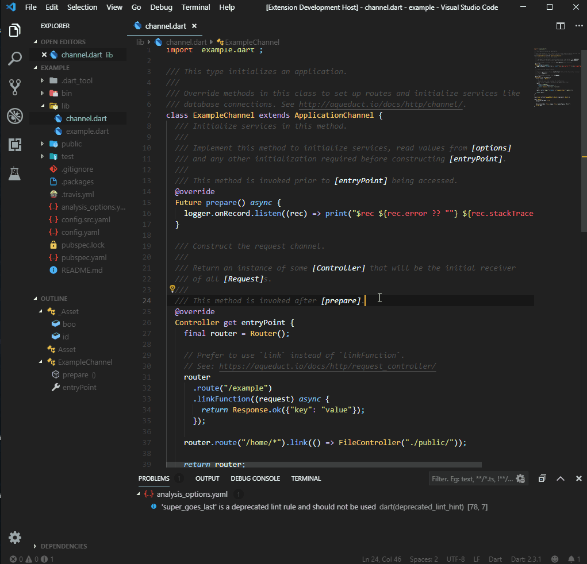

# Aqueduct Helper README

This is the README for Aqueduct Helper. This extension helps speed up API development when using the Aqueduct framework.

### Useful Links
Find below a list of useful links to help you get started.
- [Aqueduct Documentation](https://aqueduct.io/docs/)
- [Aqueduct Tutorial](https://aqueduct.io/docs/tut/getting-started/)
- [Dart Documentation](https://dart.dev/guides)

## Snippets
Find below all the possible snippets you can use while creating your APIs.

##### Configuration
- `aqu-config`: Creates a subclass for reading configuration file.
- `aqu-yaml-config`: Creates a basic YAML configuration file.

##### HTTP
- `aqu-link-func`: Creates a basic link function.
- `aqu-link`: Creates a basic link route.
- `aqu-file`: Returns the content of a file.
- `aqu-socket`: Creates a basic websocket server.

##### ORM
- `aqu-model`: Creates a basic model that replicates a database table.
- `aqu-controller`: Creates a basic resource controller.
- `aqu-column`: Creates a column annotation.
- `aqu-table`: Changes the name of the table definition.
- `aqu-pk`: Creates a primary key annotation.
- `aqu-transaction`: Creates the basic transaction.

##### Auth
- `aqu-auth-token`: Creates an auth token route that grants and refreshes tokens.
- `aqu-auth-bearer`: Creates a protected route with an OAuth 2.0 bearer token.
- `aqu-auth-basic`: Creates a protected route with basic HTTP Authentication.

##### Test
- `aqu-http-test`: Creates a simple test that expects 200 OK.
- `aqu-json-test`: Creates a simple test that expects the response to be a list of JSON objects which includes a ID which is a number.

## Commands
Find below all the possible commands you can use while creating your APIs. To use press <kbd>CTRL</kbd>+<kbd>Shift</kbd>+<kbd>P</kbd> on Windows or <kbd>⌘</kbd>+<kbd>⇧</kbd>+<kbd>P</kbd> on Mac

- `aquModel`: Creates a customisable model file.
- `aquCon`: Creates a customisable controller file.
    - You will have the option to include a get, post, put and delete request.

## Release Notes
All notable changes to Aqueduct Helper will be documented [here](https://marketplace.visualstudio.com/items/AzMoza.aqueduct-helper/changelog).

**Enjoy!**